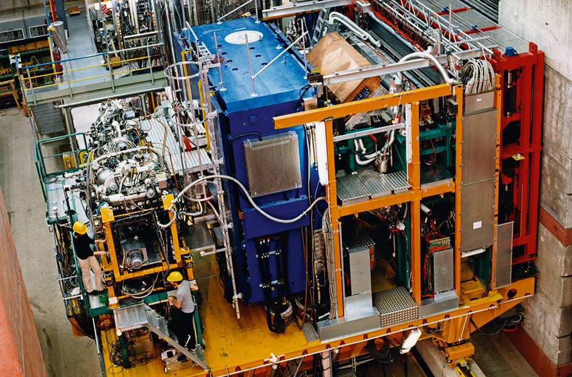

::: {.page-intro}
::: {.eyebrow}
Experiment
:::

::: {.subtitle}
An introduction to the HERMES experiment at DESY and the questions it helps students explore.
:::
:::

::: {.image-feature}

::: {.caption}
HERMES detector photograph. TODO: add verified image credit and license.
:::
:::

## Overview

HERMES was an experiment at DESY that investigated the internal structure of matter.

This page will introduce the experiment, the scientific questions it addressed, and why those questions are useful for students learning particle physics.

## What Students Should Learn

::: {.info-grid}
::: {.info-card}
### Experiment Context

- What kind of experiment HERMES was.
:::

::: {.info-card}
### Proton Structure

- What physicists mean by probing the inside of a proton.
:::

::: {.info-card}
### From Detector To Result

- How experiments connect detector measurements to physics results.
:::
:::

::: {.callout-warning}
TODO: Verify and cite concise technical background for HERMES before expanding this page.
:::

## For Teachers

This page should eventually provide a short, reliable overview suitable for classroom preparation.
